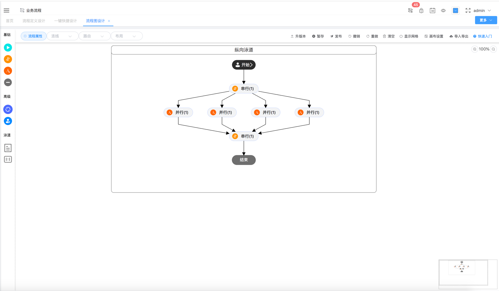

[](https://gitee.com/jackrolling/json-flow-ui/stargazers) [](https://gitee.com/jackrolling/json-flow-ui/members)  

### 如果觉得不错，给作者一个⭐️小星星⭐️Star⭐️支持下️吧

|                     欢迎进群一起交流                      |
|:-------------------------------------------------:|
| 🔥大家可扫码加入交流群，群已超200+人被限制了。可以加我微信 ll766488893 拉你入群 |

### 🔥🔥🔥JsonFlow商业版Pro已支持移动端、Vue3技术栈🔥🔥🔥

### JsonFlow在线演示（请联系作者微信ll766488893）
[点击预览](http://47.109.57.40/)（JsonFlow SpringBoot单体版本） 【备注：微服务版本已整合Pigx，感谢Pigx支持】

### JsonFlow在线文档（VIP文档暂未开源-请联系作者）
[点击预览](https://jackrolling.gitee.io/docsify/#/)


#### 绝对简单但强大易用易扩展且适应复杂场景的中国式审批的工作流（工作流引擎+前端工作流管理，请加群咨询）

### 🔥🔥🔥JsonFlow商业版Pro强大功能🔥🔥🔥
#### 注：商业版流程设计器全新自研更简单强大，核心与开源版不同

- 基于本系统开发的工单系统已在生产上平稳运行良久，生产已验证

- 商业授权与协议范围说明 - PIGX官方授权声明地址[点击预览](https://pig4cloud.com/data/doc/info/auth-intro.html)

- 请点击查看商业版Pro强大功能详情[点击预览](https://jackrolling.gitee.io/docsify/#/docs/1%E3%80%81%E7%B3%BB%E7%BB%9F%E6%96%87%E6%A1%A3%E8%AF%B4%E6%98%8E/1%E3%80%81JsonFlow%E5%BC%BA%E5%A4%A7%E5%8A%9F%E8%83%BD)


### 最新商业版本发布（废话不多说上才艺）
- 1、办理人支持人员、部门、角色等等，其他扩展模式仅需重写一个接口类
- 2、办理人员/角色均可以多选，多选界面和钉钉一致美观
- 3、多人审批方式：会签、或签、依次审批
- 4、加签类型：前加签、后加签、加并签、跳签、连续加签等等任意扩展
- 5、增加节点自动审批，支持服务类节点
- 6、审批按钮已支持按钮权限配置
- 7、表单设计已支持移动端显示
- 以下为3月8号发布
- 截图是自动布局算法布局，绝对授权类工作流 + 自研引擎No.1
- 简单易用易扩展功能强大，画布内的节点、连线均可拖拽，调整大小，未来可自定义图形
- 1、支持自由流程、任意流转
- 2、自动布局或手动布局（多方向），自动布局算法基本全网最优
- 3、支持后台代码生成任意节点，并在图中都有显示
- 4、支持小地图、托拉拽任意连线和文本
- 5、更多更新等你来体验
- 
- 

**🔥🔥🔥对比传统BPM🔥🔥🔥**
- 1、解决传统BPM流程复杂点难扩展、后期维护闹心、各种数据统计恶心等痛点问题！！

- 2、支持Online自动建表设计，以便未来好统计数据。自动增删改查，零编码一键发起

- 3、JsonFlow实现真正的低代码开发，非常简单的Online一键流程设计（配置项少）与一键申请办公

- 4、如何快速二次开发？有一套较规范且简单的【两套】开发流程，同时满足Online开发设计与定制化开发设计

- 5、前后端完全自研可控，二开非常简单自由（支持Online代码自动生成），且符合较复杂中国式审批场景

- 6、相对于传统BPM，JsonFlow工作流引擎与工单逻辑是分开的，方便未来数据统计

- 7、目前工作流相关表14张，比传统BPM几十张表少很多，学习成本低！二开分分钟的事！！

注：本系统没有贬低其他工作流系统的意思，请悉知

#### 系统介绍

- 一个神奇的自研工作流JsonFlow，前后端非常简单的纯Json交互（格式简单），支持任意拖拉拽生成流程图，非常容易进行二次开发。


- 1.JsonFlow工作流基于自研的流程设计器 + 自研后端Java工作流引擎，组成了一套纯JSON数据交互的自研工作流引擎系统 + 工作流管理系统。


- 2.本系统无论前端还是后端，其学习成本明显低于开源工作流引擎及附带流程设计器，能够快速上手前后端实现逻辑，更方便用户快速进行二次开发。


- 3.本系统前端流程设计器，采用Vue ElementUI + 自研实现，支持可任意托拉拽与任意连线绘制流程图，简单易用具有更友好的操作方式。

#### 工作流管理、工单管理、工作交接模块

- 本系统将工作流引擎与工单系统分离，目的在于解耦减少业务对工作流的入侵，以便于业务后期各种复杂报表统计


- 本系统同时支持在线工作与任务交接，弥补了传统BPM工作流需单独处理的不足，方便公司人员流动后的工作交接

#### 钉钉UI效果演示
- 拖拽节点到绘图区，进行任意连线。流程设计无需双击节点配置属性，鼠标移动到节点上会自动显示右键菜单直接设置，非常方便快捷操作
- 
- 查看流程图：鼠标移动到节点上可显示不同状态与图标、节点信息与审批信息，放到线上可显示条件信息
- 

#### 在线设计
- 开发平台：代码自动生成，方便快速进行二次定制化流程开发
- 自动创建表设计：以便未来统好计数据 + 自动增删改查API，零编码一键发起（很复杂的可能需编码调整）
- 一键快捷设计：页面设置 + 表单设计 + 流程设计，还可以单独再设计审批页面（下面介绍），不仅如此还是可拖拽的流程图设计
- 

#### 在线办公
##### 办公申请
- 支持在线一键发起办公申请工单，办理任务、WebSocket任务消息通知等等
  
##### 任务管理
- 在待办任务点审批，可以查看/修改工单信息、审批过程、流程图。办理人员、页面支持高度可配置化
- 流程设计与表单设计增加导入导出功能（Avue表单组件兼容大部分移动端显示）
  
- 流程实例管理
- 更多功能期待你体验...

#### 流程设计器支持：
- 节点分为五种：开始节点、串行节点、并行节点、结束节点、虚拟节点，还有一个节点任务
- 审批过程增加时间线显示UI效果(以Timeline时间线方式显示)，可选择表格或时间线两种不同的显示方式
- 预览流程图、发布流程
- 更多功能期待你体验...

#### 数据结构
```json
{
  "nodeList": [
    {
      "type": "start",
      "nodeName": "开始",
      "icon": null,
      "attrs": {
        "pcTodoUrl": null,
        "pcFinishUrl": null
      },
      "clazz": {
        "clazz": null,
        "methods": null
      },
      "defJob": {
        "jobName": "任务名称",
        "userId": null,
        "roleId": null
      },
      "jobSize": 1,
      "id": "1661145449179000002",
      "height": 50,
      "x": 210,
      "width": 50,
      "y": 205
    }
  ],
  "linkList": [
    {
      "type": "link",
      "label": "",
      "sourceId": "1661145449179000002",
      "targetId": "1661145452800000003",
      "attrs": {
        "varKey": null,
        "varVal": null
      },
      "id": "1661145456855000004",
      "icon": null
    }
  ],
  "attrs": {
    "id": "1661145437059000001"
  },
  "status": "0"
}
```

#### 本地安装

* 下载本项目：npm install

* 启动项目：npm run serve

* 构建项目dist：npm run build

#### 关于作者&&微信群
- 欢迎大家进群一起交流 🔥🔥🔥 如果群二维码失效了，可以直接加我微信拉群，感谢

<table>
  <tr>
    <td></td>
    <td></td>
  </tr>
</table>
