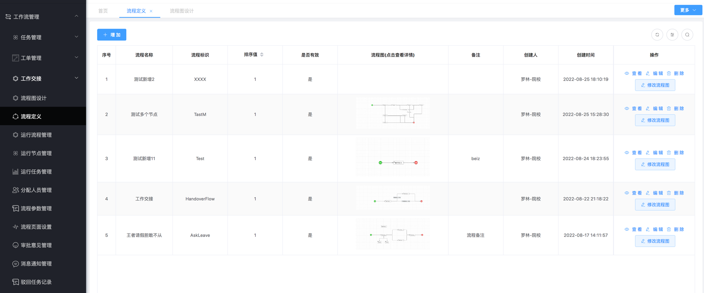
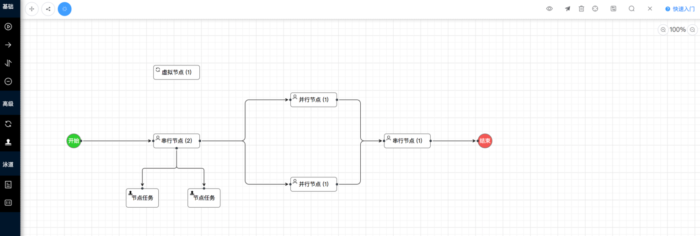
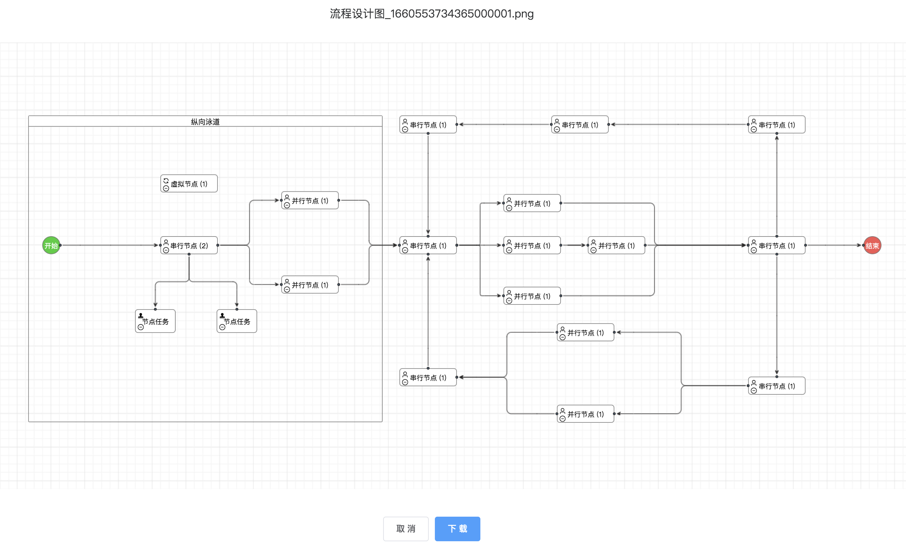

[](https://gitee.com/jackrolling/json-flow-ui/stargazers) [](https://gitee.com/jackrolling/json-flow-ui/members)  

### 如果觉得不错，给作者一个⭐️小星星⭐️Star⭐️支持下️吧

|                     欢迎进群一起交流                      |
|:-------------------------------------------------:|
| 🔥大家可扫码加入交流群，群已超200+人被限制了。可以加我微信 ll766488893 拉你入群 |

### JsonFlow在线演示
[点击预览](http://47.109.57.40/)（JsonFlow SpringBoot单体版本）
[点击预览](http://flow.pigx.vip/#/login)（感谢Pigx的支持。注：选择租户：JsonFlow，且只是【工作流管理模块】）

### JsonFlow在线文档（更多后端及牛X功能文档暂未开源）
[点击预览](https://jackrolling.gitee.io/docsify/#/)

#### 绝对简单易用且适合较复杂场景的中国式审批的工作流（工作流引擎+前端工作流管理，请加群咨询）

**🔥🔥🔥对比传统BPM🔥🔥🔥**
- 1、支持在线自动建表设计，以便未来好统计数据。自动增删改查，无需编码一键发起
- 1、JsonFlow实现真正的低代码开发，极其简单全薪的一键流程设计（配置项少）与一键申请办公
- 2、如何快速二次开发？有一套较规范且简单的【两套】开发流程，同时满足在线开发设计与定制化开发设计
- 3、前后端完全自研可控，二开非常简单（支持代码一键生成），且符合较复杂中国式审批场景
- 4、目前工作流相关表14张，比传统BPM几十张表少很多，学习成本低！二开分分钟的事！！
- 5、相对于传统BPM，JsonFlow工作流引擎与工单逻辑是分开的，方便未来数据统计
- 6、更多优点请看在线文档【JsonFlow强大功能】

注：本系统没有贬低其他工作流系统的意思，请悉知

#### 系统介绍
- 基于本系统开发的工单系统已在生产上平稳运行良久，生产已验证


- 一个神奇的自研工作流JsonFlow，前后端非常简单的纯Json交互（格式简单），支持任意拖拉拽生成流程图，非常容易进行二次开发。


- 1.JsonFlow工作流基于JsPlumb的流程设计器 + 自研后端Java工作流引擎，组成了一套纯JSON数据交互的工作流系统。


- 2.本系统无论前端还是后端，其学习成本明显低于市面上开源的工作流引擎及附带的流程设计器，能够快速上手前后端实现逻辑，更方便用户快速进行二次开发。


- 3.本系统前端流程设计器，采用Vue ElementUI + JsPlumb实现，支持可任意托拉拽与任意连线绘制流程图，简单易用具有更友好的操作方式。

#### 工作流引擎支持：
- 1.支持基础的多种审批模式：支持抄送、审批、触发器、条件分支、并行分支等


- 2.除此之外，灰常适合中国式的审批，如下：

  正常配置人员、动态分配、动态计算分配人员，动态计算节点增量任务，驳回任意节点。

  可不等待兄弟任务、支持业务侧开启和计算任务，不满足条件可继续流转下一节点。

  支持vue页面配置化，支持工作任务交接。

#### 🔥🔥🔥JsonFlow商业版Pro强大功能🔥🔥🔥
- 1、条件表达式 + 规则引擎（满足你复杂的条件）


- 2、一键快捷流程设计：页面设置 + 表单设计 + 流程设计（设计概念仿钉钉、宜搭，更多的是：你还可以单独再设计审批页面）


- 3、自动创建表（以便未来统计数据问题） + 自动增删改查，无需编码一键发起（很复杂的可能得编码调整）


- 4、自动取值：流程参数取值、动态分配人员取值（可通过配置自动取值，无需编码）


- 5、流程图节点显示不同状态与图标，鼠标移动到节点可显示节点与审批信息，放到线上可显示条件信息

- 6、流程相关表现在共14张表，比开源BPM少了很多！但常用功能不少且更符合中国式审批流

- 7、开发平台：代码自动生成，方便快速进行二次定制化流程开发

#### 工作流与工单系统解耦：

- 本系统将工作流引擎与工单系统分离，目的在于解耦减少业务对工作流的入侵，以便于业务后期各种复杂报表统计


- 本系统同时支持在线工作与任务交接，弥补了传统BPM工作流需单独处理的不足，方便公司人员流动后的工作交接

#### 实现简要概述：
- 节点分类非常简单，发起节点、串行节点、并行节点、结束节点、虚拟节点。 主要基于传统BPM使用的感受，考虑到传统BPM类型过多复杂且极少用，故本工作流系统仅分6种节点类型，常使用的主要是串行、并行节点。


- 串行顾名思义流程只有一个分支往下走，并行则表示流程可以同时流转到多个分支，只要掌握这个概念，使用会非常简单。这样设计的原因是传统的BPM有各种的节点或网关，但实际上使用的很少，网关本系统采用串行+条件 或 并行+条件来代替。


- 任务类型分为个人、角色、或签。个人即表示由某个人来办理这个任务，角色则表示拥有同一个角色的人都可以办理，谁先办理属于谁。会签在本系统中采用多个节点任务来表达一个节点同时需多个人来办理的情况


- 办理人员类型分为正常分配、动态分配、动态计算，常使用的主要是正常分配、动态分配。正常分配指可指定一个人或一个角色来办理，动态分配则表示根据某个SPEL表达式来动态指定某个人，动态计算则表示根据多个角色或多个人，业务侧手动调用节点任务增量接口，来动态计算和生成多个节点任务。


#### 工作流管理、工单管理、工作交接模块
- 

#### 钉钉UI效果演示
- 
- 流程图节点显示不同状态与图标，鼠标移动到节点可显示节点与审批信息，放到线上可显示条件信息
- 

#### 在线设计
- 自动建表设计：以便未来统好计数据 + 自动增删改查API，无需编码一键发起（很复杂的可能得编码调整）
- 一键快捷设计：页面设置 + 表单设计 + 流程设计，还可以单独再设计审批页面（下面介绍），不仅如此还是可拖拽的流程图设计
- 

#### 在线办公
##### 办公申请
- 支持在线一键发起办公申请工单，办理任务等等
  
##### 任务管理
- 在待办任务查看自己需要办理的任务，办理人员支持高度配置化
- 在待办任务点审批，可以查看/修改工单信息、审批过程、流程图。页面支持高度可配置化
  
- 流程实例管理
- 更多功能期待你体验...

#### 流程设计器支持：
- 节点分为五种：开始节点、串行节点、并行节点、结束节点、虚拟节点，还有一个节点任务

- 拖拽节点到绘图区，进行任意连线。流程设计无需双击节点配置属性，鼠标移动到节点上会自动显示右键菜单直接设置，非常方便快捷操作

  

- 预览流程图、发布流程
  
- 更多功能期待你体验...

#### 数据结构
```json
{
  "nodeList": [
    {
      "type": "start",
      "nodeName": "开始",
      "icon": null,
      "attrs": {
        "pcTodoUrl": null,
        "pcFinishUrl": null
      },
      "clazz": {
        "clazz": null,
        "methods": null
      },
      "defJob": {
        "jobName": "任务名称",
        "userId": null,
        "roleId": null
      },
      "jobSize": 1,
      "id": "1661145449179000002",
      "height": 50,
      "x": 210,
      "width": 50,
      "y": 205
    }
  ],
  "linkList": [
    {
      "type": "link",
      "label": "",
      "sourceId": "1661145449179000002",
      "targetId": "1661145452800000003",
      "attrs": {
        "varKey": null,
        "varVal": null
      },
      "id": "1661145456855000004",
      "icon": null
    }
  ],
  "attrs": {
    "id": "1661145437059000001"
  },
  "status": "0"
}
```

#### 本地安装

* 下载本项目：npm install

* 启动项目：npm run dev

* 构建项目dist：npm run build

#### 关于作者&&微信群
- 欢迎大家进群一起交流 🔥🔥🔥
- 如果群二维码失效了，可以直接加我微信拉群，感谢

<table>
  <tr>
    <td></td>
    <td></td>
  </tr>
</table>
