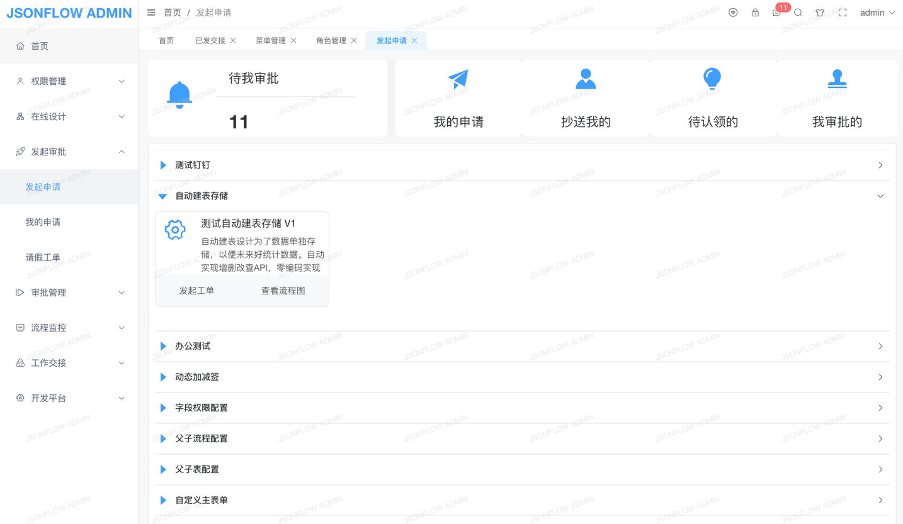

[](https://gitee.com/jackrolling/json-flow-ui/stargazers) [](https://gitee.com/jackrolling/json-flow-ui/members)  

### 如果觉得不错，给作者一个⭐️小星星⭐️Star⭐️支持下️吧

|                     欢迎进群一起交流                      |
|:-------------------------------------------------:|
| 🔥大家可扫码加入交流群，群已超200+人被限制了。可以加我微信 ll766488893 拉你入群 |

#### 开源仅一个前期的流程设计器（[借鉴vue-flow-design-plus，将Ant Design改为ElementUI并重构](https://gitee.com/zhangyeping/vue-flow-design-plus)），与商业版本（完全自研）技术栈不同！

### JsonFlow在线演示（请联系作者微信ll766488893）
[点击预览](http://47.109.57.40/)（JsonFlow SpringBoot单体版本） 【备注：微服务版本整合PIGX】

### JsonFlow在线文档（VIP文档暂未开源-请联系作者）
[点击预览](https://flow.pig4cloud.com/)

#### 🎉🎉🎉JsonFlow系统：创新中式工作流引擎，解锁工作效率新境界

## 简要概述

**🔥🔥已集成人工智能AI，支持AI助手发起工单，使工作流更智能（`需单独采购AI`）**

🔥🔥支持`Vue3技术栈`，一套代码同时支持 **`钉钉简单模式与专业模式`**，并提供`两套可选UI界面`，同时适配 **`PC、Pad、H5`** 多端显示，支持`移动端APP办公`（`含流程图回显`）

🔥🔥支持表结构设计、表单字段定义、表单设计、流程设计、打印模板设计等设计功能，表单设计器支持 **`自定义组件`** 即接入 **`本地Vue业务组件`**，接入非常简单高效

## 全网Top级功能🔥自研国产分布式流程引擎
- 1、支持 **`全流程预测`**，可根据表单数据与流程配置信息预测，包括`流转轨迹预测、节点参与者预测、连线条件预测、审批过程预测`
- 2、支持 **`节点路由`**，可根据接口返回值 或 表单数据的字段值，配置对应的路由动作（可自定义随意扩展）。如`暂停当前节点、开启下一节点、通过、驳回到节点、退回首节点、退回上一步、终止流程、提前结束`
- 3、支持众多中国式特色审批操作，支持`达梦`等国产数据库，`自研报表设计器`支持`自定义报表格式`导出
- 4、对已发起的`流程图实例`再次可视化`单独编辑配置`，如`加减节点`（`在图中自动布局回显`）、`加减参与者`即加减签。非常方便维护
- 5、对已发起的`表单实例`再次可视化可`单独编辑配置`，如改变页面布局或字段。非常方便维护
- 6、选择参与者支持`用户、角色、岗位、部门`，流程图设计器支持节点与任务分离自由`切换UI`显示效果
- 7、工作流引擎与业务表单系统`完全解耦`，支持配置`第三方业务系统`Http接口或表单

### 🔥🔥🔥JsonFlow商业版Pro强大功能🔥🔥🔥
#### 注：商业版流程设计器全新自研更简单强大，核心与开源版不同

- 基于本系统开发的工作流系统已在生产上平稳运行良久，生产已验证

- 商业授权与协议范围说明 - PIGX官方授权声明地址[点击预览](https://pig4cloud.com/data/doc/info/auth-intro.html)
- 请点击查看商业版Pro强大功能详情[点击预览](https://flow.pig4cloud.com/home/function/)
- 请点击查看对比传统BPM详情[点击预览](https://flow.pig4cloud.com/home/compare/)

#### 系统介绍

- 🎉🎉 JsonFlow工作流是一个`100%纯国产`自研的`分布式`流程引擎系统(`非开源BPM`)，内置自动布局最优算法布局，前后端纯JSON交互格式简单，支持`信创国产化`专为中国式特色审批而生。支持在线零代码进行表单设计与流程设计，`前后端代码完全自研可控，非常容易进行二次开发`，致力于解决传统BPM流程复杂难扩展、后期维护闹心、数据统计烦心等痛点问题

- 🔥🔥 此系统从 2019 开始发布生产环境使用，不断优化趋于稳定，于 2022 年正式发布商业版！经过作者不断迭代和优化，孵化出了简单易用易扩展稳定强大的国产工作流系统。

#### 操作介绍
- JsonFlow工作流支持表结构设计、表单字段定义、表单设计、流程设计、打印模板设计等操作，配置简单高效易理解，几分钟即可完成

#### 钉钉UI界面⭐️-常用于普通用户操作


#### 专业UI界面⭐-常用于专业用户操作️
- 流程图设计：拖拽节点到绘图区，进行任意连线。可自由设置连线/路由/布局`改变连线形式`、画布内的节点/连线均`可拖拽和调整大小`，未来可自定义图形


- 查看流程图：流程图节点与连线根据状态显示不同颜色和图标，鼠标移动到节点可显示节点与审批信息，放到线上可显示条件信息（注：显示信息可自行调整）


#### 在线设计
- 模型设计分三个步骤`表单设置、表单设计、流程设计`，一次托拉拽即可完成表结构设计、表单字段定义、表单设计、流程设计等设计功能。流程设计的`流程图`和表单设计的`表单`均支持`PC、Pad、H5（即APP端）`，一次设计多端显示


#### 在线办公
##### 发起审批
- 支持在线一键发起办公申请工单、办理任务、WebSocket任务消息通知等
  


##### 审批管理
- 在待我审批菜单中点审批，可以查看/修改表单信息、查看审批过程、查看流程图等信息
  


#### 流程监控


- 更多功能期待你体验...

#### 其他功能：
- 节点分为五种：开始节点、串行节点、并行节点、结束节点、虚拟节点，以及一个节点任务
- 更多功能期待你体验...

#### 数据结构
```json
{
  "nodeList": [
    {
      "type": "start",
      "nodeName": "开始",
      "icon": null,
      "attrs": {
        "pcTodoUrl": null,
        "pcFinishUrl": null
      },
      "clazz": {
        "clazz": null,
        "methods": null
      },
      "defJob": {
        "jobName": "任务名称",
        "userId": null,
        "roleId": null
      },
      "jobSize": 1,
      "id": "1661145449179000002",
      "height": 50,
      "x": 210,
      "width": 50,
      "y": 205
    }
  ],
  "linkList": [
    {
      "type": "link",
      "label": "",
      "sourceId": "1661145449179000002",
      "targetId": "1661145452800000003",
      "attrs": {
        "varKey": null,
        "varVal": null
      },
      "id": "1661145456855000004",
      "icon": null
    }
  ],
  "attrs": {
    "id": "1661145437059000001"
  },
  "status": "0"
}
```

#### 本地安装

* 下载本项目：npm install

* 启动项目：npm run serve

* 构建项目dist：npm run build

#### 关于作者&&微信群
- 欢迎大家进群一起交流 🔥🔥🔥 如果群二维码失效了，可以直接加我微信拉群，感谢

<table>
  <tr>
    <td></td>
    <td></td>
  </tr>
</table>
