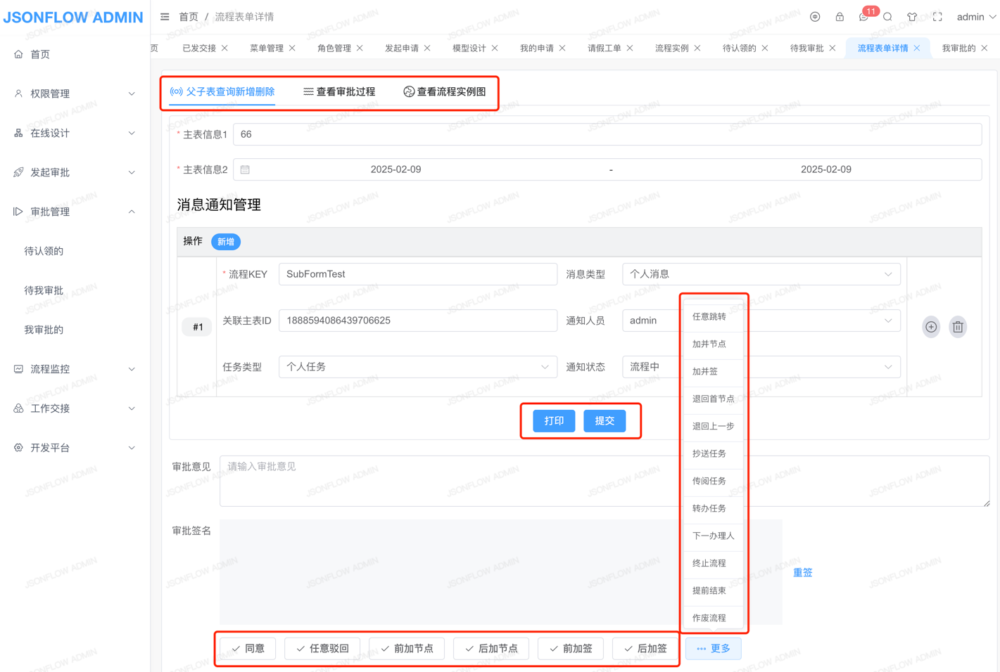

[](https://gitee.com/jackrolling/json-flow-ui/stargazers) [](https://gitee.com/jackrolling/json-flow-ui/members)  

### 如果觉得不错，给作者一个⭐️小星星⭐️Star⭐️支持下️吧

|                     欢迎进群一起交流                      |
|:-------------------------------------------------:|
| 🔥大家可扫码加入交流群，群已超200+人被限制了。可以加我微信 ll766488893 拉你入群 |

### JsonFlow在线演示（请联系作者微信ll766488893）
[点击预览](http://47.109.57.40/)（JsonFlow SpringBoot单体版本） 【备注：微服务版本整合PIGX】

### JsonFlow在线文档（VIP文档暂未开源-请联系作者）
[点击预览](http://1.15.77.119:9000/)


#### 🎉🎉🎉绝对简单但强大易用易扩展且适应复杂场景的中国式审批的工作流引擎系统

### 🔥🔥🔥JsonFlow商业版Pro已支持Vue3技术栈，一套前端代码同时支持[钉钉简单模式与专业模式]()，并提供[两套可选UI界面]()，同时适配[PC、Pad、H5]()多端显示，支持[移动端APP办公]()（含流程图回显）🔥🔥🔥

### 🔥🔥🔥JsonFlow商业版Pro强大功能🔥🔥🔥
#### 注：商业版流程设计器全新自研更简单强大，核心与开源版不同

- 基于本系统开发的工作流系统已在生产上平稳运行良久，生产已验证

- 商业授权与协议范围说明 - PIGX官方授权声明地址[点击预览](https://pig4cloud.com/data/doc/info/auth-intro.html)
- 请点击查看商业版Pro强大功能详情[点击预览](http://1.15.77.119:9000/home/function/)
- 请点击查看对比传统BPM详情[点击预览](http://1.15.77.119:9000/home/compare/)

#### 系统介绍

- 🎉🎉 JsonFlow工作流已支持`Vue3技术栈`，一套前端代码同时支持`钉钉简单模式与专业模式`，并提供`两套可选UI界面`，同时适配`PC、Pad、H5`多端显示，支持`移动端APP办公`（含流程图回显）

- 🔥🔥 JsonFlow提供文档和配套视频，**功能描述清晰简洁，学习成本低**，持续更新优化中（VIP文档-请先订阅VIP）
#### 工作流管理、工单管理、工作交接模块

- 本系统将工作流引擎与工单系统分离，目的在于解耦减少业务对工作流的入侵，以便于业务后期各种复杂报表统计

- 本系统同时支持在线工作与任务交接，弥补了传统BPM工作流需单独处理的不足，方便公司人员流动后的工作交接

#### 钉钉UI界面⭐️-常用于普通用户操作
- 

#### 专业UI界面⭐-常用于专业用户操作️
- 流程图设计：拖拽节点到绘图区，进行任意连线。在流程设计时可将鼠标移动到节点或连线上右键菜单设置属性（节点可直接双击），非常方便快捷操作
- 可自由设置连线/路由/布局`改变连线形式`、画布内的节点/连线均`可拖拽和调整大小`，未来可自定义图形
- 
- 查看流程图：流程图节点显示不同状态与图标，鼠标移动到节点可显示节点与审批信息，放到线上可显示条件信息（注：显示信息可自行调整）
- 

#### 在线设计
- 开发平台：代码自动生成，方便快速进行二次定制化流程开发
- 一键快捷设计【表单设计 + 流程设计（表单/审批页面权限） + 页面设置】
- 

#### 在线办公
##### 办公申请
- 支持在线一键发起办公申请工单，办理任务、WebSocket任务消息通知等等
  
##### 任务管理
- 在待办任务点审批，可以查看/修改工单信息、审批过程、流程图。办理人员、页面支持高度可配置化
  
- 流程实例管理
- 更多功能期待你体验...

#### 其他功能：
- 节点分为五种：开始节点、串行节点、并行节点、结束节点、虚拟节点，以及一个节点任务
- 审批过程增加时间线显示UI效果(以Timeline时间线方式显示)，可选择表格或时间线两种不同的显示方式
- 更多功能期待你体验...

#### 数据结构
```json
{
  "nodeList": [
    {
      "type": "start",
      "nodeName": "开始",
      "icon": null,
      "attrs": {
        "pcTodoUrl": null,
        "pcFinishUrl": null
      },
      "clazz": {
        "clazz": null,
        "methods": null
      },
      "defJob": {
        "jobName": "任务名称",
        "userId": null,
        "roleId": null
      },
      "jobSize": 1,
      "id": "1661145449179000002",
      "height": 50,
      "x": 210,
      "width": 50,
      "y": 205
    }
  ],
  "linkList": [
    {
      "type": "link",
      "label": "",
      "sourceId": "1661145449179000002",
      "targetId": "1661145452800000003",
      "attrs": {
        "varKey": null,
        "varVal": null
      },
      "id": "1661145456855000004",
      "icon": null
    }
  ],
  "attrs": {
    "id": "1661145437059000001"
  },
  "status": "0"
}
```

#### 本地安装

* 下载本项目：npm install

* 启动项目：npm run serve

* 构建项目dist：npm run build

#### 关于作者&&微信群
- 欢迎大家进群一起交流 🔥🔥🔥 如果群二维码失效了，可以直接加我微信拉群，感谢

<table>
  <tr>
    <td></td>
    <td></td>
  </tr>
</table>
